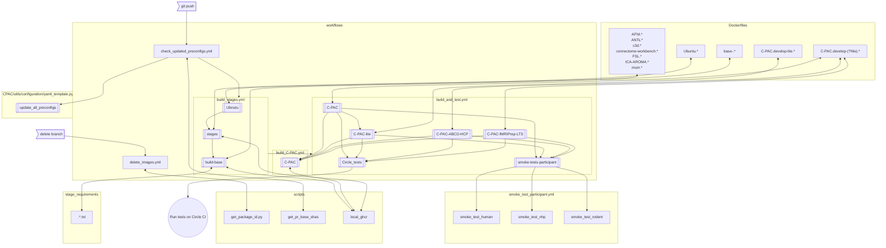

# C-PAC/.github README

This directory contains Dockerfiles, scripts, requirements files, and workflow configurations for [this repository's GitHub Actions](https://github.com/FCP-INDI/C-PAC/actions).

When updating these files, please update this README as necessary.

[The `workflows` directory](./workflows) contains the configurations for the Actions themselves. The other directories support these configs.

In this [Mermaid flowchart](https://mermaid.js.org/syntax/flowchart.html), these shapes are used:

concept | shape
---|---
directory | `subgraph`
file | rectangle (`[]`) or `subgraph`
workflow job | subprocess (`[[]]`)
trigger action | asymetric (`>]`)
external API | circle (`(())`)
