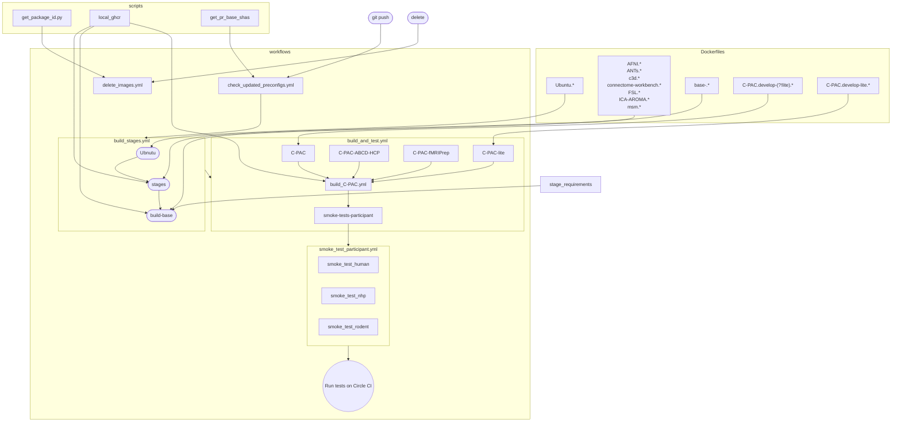

This directory contains Dockerfiles, scripts, requirements files, and workflow configurations for [this repository's GitHub Actions](https://github.com/FCP-INDI/C-PAC/actions).

When updating these files, please update this README as necessary.

[The `workflows` directory](./workflows) contains the configurations for the Actions themselves. The other directories support these configs.

