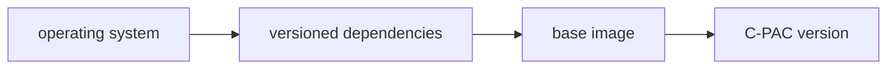

# C-PAC/.github README

This directory contains Dockerfiles, scripts, requirements files, and workflow configurations for [this repository's GitHub Actions](https://github.com/FCP-INDI/C-PAC/actions).

When updating these files, please update this README as necessary.

[The `workflows` directory](./workflows) contains the configurations for the Actions themselves. The other directories support these configs.


In this [Mermaid flowchart](https://mermaid.js.org/syntax/flowchart.html), these shapes are used:

concept | shape
---|---
directory | `subgraph`
file | rectangle (`[]`) or `subgraph`
workflow job | subprocess (`[[]]`)
trigger action | asymetric (`>]`)
external API | circle (`(())`)

## Multistage builds

C-PAC images are built in stages like



See [fcp-indi.github.io/docs/nightly/developer/installation](https://fcp-indi.github.io/docs/nightly/developer/installation) for more information about C-PAC's use of multistage builds.

GitHub Actions will dynamically skip building stages based on when a stage's Dockerfile or a workflow file was last modified. To force a stage to rebuild, include

```BASH
[rebuild ${DOCKERFILE_BASENAME}]
```

in a commit message and push. For example, to rebuild `ghcr.io/fcp-indi/c-pac/ubuntu:bionic-non-free`, include

```BASH
[rebuild Ubuntu.bionic-non-free]
```

in the commit message. For this to work, all of these must be true:

1. The Dockerfile is listed in a

   ```YAML
   strategy:
     matrix:
       Dockerfile: 
   ```

   in a job in a [workflow](.workflows) file.
2. The Dockerfile exists.
3. The commit message including

   ```BASH
   [rebuild ${DOCKERFILE_BASENAME}]
   ```

   is for the most recent commit when pushing to GitHub.
