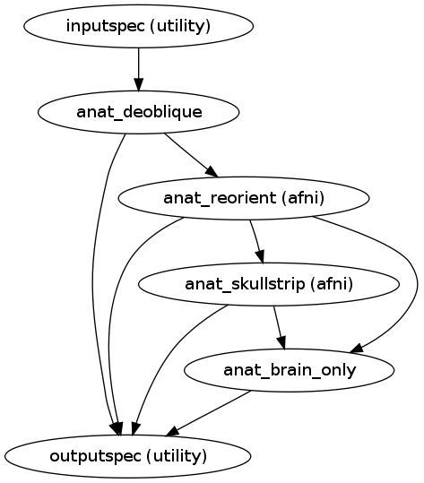
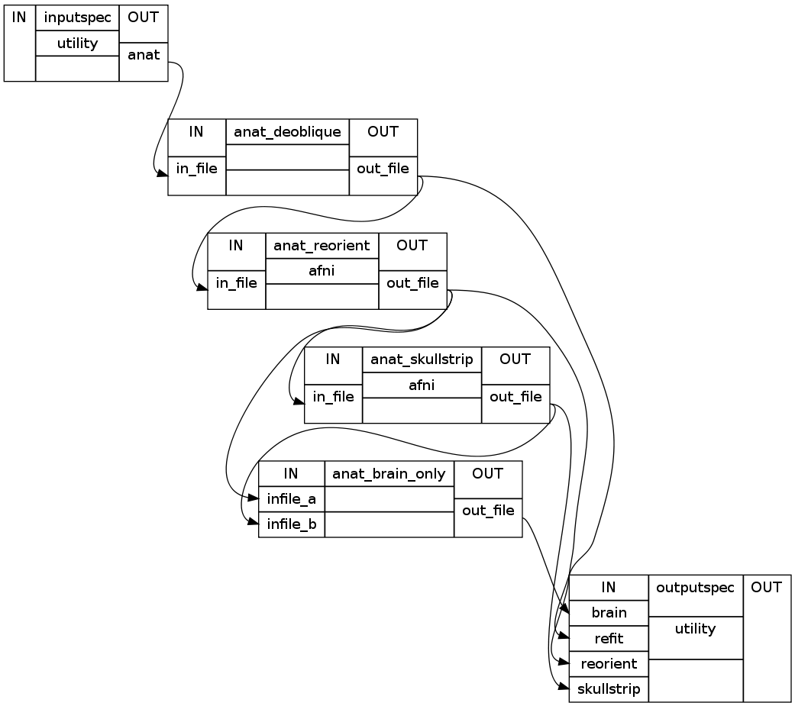

.. AUTO-GENERATED FILE -- DO NOT EDIT!

.. _example_anat:

Anatomical Preprocessing
===============================

The main purpose of this workflow is to process T1 scans. Raw mprage file is deobliqued, reoriented
into RPI and skullstripped. Also, a whole brain only mask is generated from the skull stripped image
for later use in registration.

Source code: `anat_preproc <https://github.com/ssikka/NKI_NYU_Nipype/blob/development/base.py#L250>`_

**Inputs**:
-----------

- *inputspec.anat* : (mprage file or a list of mprage nifti file)
    User input anatomical(T1) Image, in any of the 8 orientations

**Outputs**:
------------

- *outputspec.refit* : (a nifti file)
    Deobliqued anatomical data
- *outputspec.reorient* : (a nifti file)
    RPI oriented anatomical data 
- *outputspec.skullstrip* : (a nifti file)
    Skull Stripped RPI oriented mprage file with normalized intensities.
- *outputspec.brain* : (a nifti file)
    Skull Stripped RPI Brain Image with original intensity values and not normalized or scaled.

Example
-------

>>> import anat
>>> prproc = create_anat_preproc()
>>> preproc.inputs.inputspec.anat='sub1/anat/mprage.nii.gz'
>>> preporc.run() #doctest: +SKIP

**Commands in Order of Execution**
----------------------------------

- Deobliqing the scans
.. code-block:: python

    3drefit -deoblique mprage.nii.gz

For information on Command and the options used, please refer to : `3drefit <http://afni.nimh.nih.gov/pub/dist/doc/program_help/3drefit.html>`_

- Re-orienting the Image into Right-to-Left Posterior-to-Anterior Inferior-to-Superior  (RPI) orientation
.. code-block:: python

    3dresample -orient RPI -prefix mprage_RPI.nii.gz -inset mprage.nii.gz

For information on Command and the options used, please refer to : `3dresample <http://afni.nimh.nih.gov/pub/dist/doc/program_help/3dresample.html>`_

- SkullStripping the Image
.. code-block:: python

    3dSkullStrip -input mprage_RPI.nii.gz -o_ply mprage_RPI_3dT.nii.gz

For information on Command and the options used, please refer to : `3dSkullStrip <http://afni.nimh.nih.gov/pub/dist/doc/program_help/3dSkullStrip.html>`_

- Creating a Whole Brain Mask. The skullstrippping step modifies the intensity values. To get back the original intensity values,
  we do an element wise product of  RPI data with step function of skull Stripped data.
.. code-block:: python

    3dcalc -a mprage_RPI.nii.gz -b mprage_RPI_3dT.nii.gz -expr 'a*step(b)' -prefix mprage_RPI_3dc.nii.gz

For information on Command and the options used, please refer to : `3dcalc <http://afni.nimh.nih.gov/pub/dist/doc/program_help/3dcalc.html>`_

High Level Workflow Graph:
--------------------------

Detailed Workflow Graph:
------------------------

