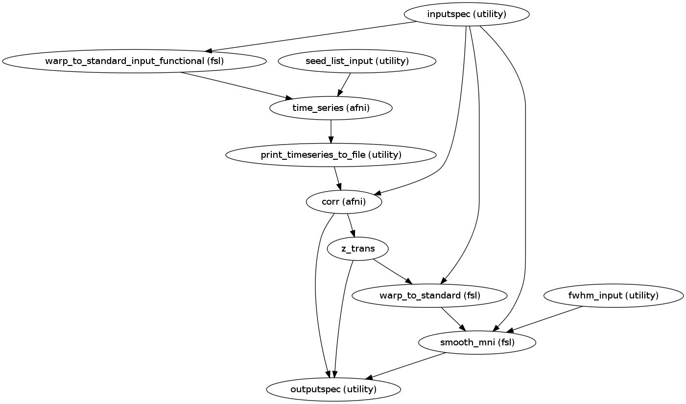
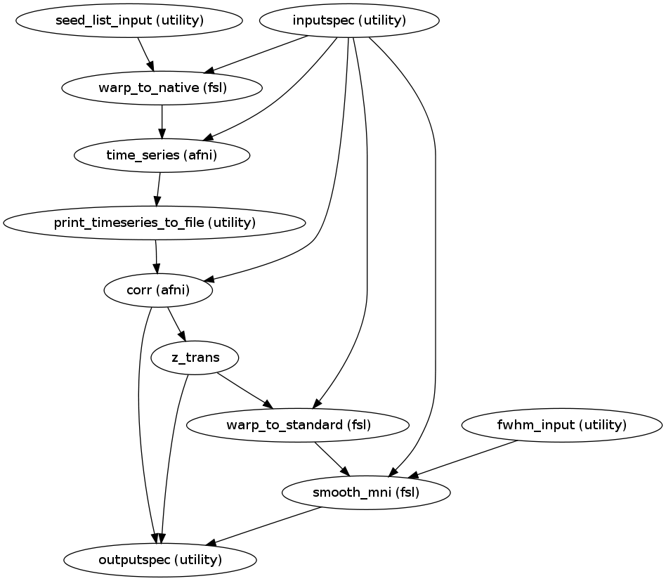

.. AUTO-GENERATED FILE -- DO NOT EDIT!

.. _example_sca:

Seed Based Correlation Analysis
===============================

Map of the correlations of the Region of Interest(Seed in native or MNI space) with the rest of brain voxels. The map is normalized to contain Z-scores, mapped in standard space and treated with spatial smoothing.

Source code: `sca_preproc <https://github.com/ssikka/NKI_NYU_Nipype/blob/development/base.py#L1540>`_

**INPUTS**:
------------

* *seed_list_input.seed_list:* (a list of existing nifti files)
        A list of seeds/ ROI iin MNI space.

* *extraction_space:* (a string)
        Options are 'mni' or 'native'.
        Extract time series from ROI in MNI space or extract it in subjects native space.

* *inputspec.rest_res_filt*: (an existing nifti file)
        Band passed Image with Global Signal , white matter, csf and motion regression. Recommended bandpass filter (0.001,0.1) )
        (rest_res_bandpassed.nii.gz)

* *inputspec.rest_mask2standard:* (an existing nifti file)
        A mask volume(derived from the functional volume) in standard in standard space.
        Used in spatial smoothing the Z-transformed correlations in MNI space

* *inputspec.premat:* (an existing affine transformation .mat file for transformation from native functional space to T1 space)
        Specifies an affine transform that should be applied to the data prior to the non-linear warping(example_func2highres.mat).

* *inputspec.postmat:* (an existing affine transformation .mat file for transformation from T1 space to native functional space)
        Specifies an affine transform that should be applied to the data following to the non-linear warping(highres2example_func.mat).

* *inputspec.fieldcoeff_file:* (an existing nifti file)
        File with warp coefficients/fields.
        This typically the output given by the -cout parameter of fnirt during registration step
        (stand2highres_warp.nii.gz,  highres2standard_warp.nii.gz).

* *inputspec.ref:* (an existing nifti file)
        When Registering from MNI space to native space use the mean functional image in native space example_func.nii.gz is used.
        When registering from native to MNI MNI152_T1_STANDARD_RES.nii.gz is used(target space).

* *fwhm_input.fwhm*: (A list of floating point numbers)
        For spatial smoothing the Z-transformed correlations in MNI space.
        Generally the value of this parameter is 1.5 or 2 times the voxel size of the input Image.

**OUTPUTS**:
-------------

*	*outputspec.correlations* (a nifti file)
		Correlations for the seed (corr.nii.gz).

*	*outputspec.z_trans_correlations* (a nifti file)
		Fisher Z transformed correlations of the seed (corr_Z.nii.gz).

*	*outputspec.z_2standard* (a nifti file)
		Registered Z-Transformed Correlations to Standard Space (corr_Z_2standard.nii.gz).

*	*outputspec.z_2standard_FWHM* (a nifti file)
		Spatially smoothed corr_Z_2standard.nii.gz (corr_Z_2standard_FWHM.nii.gz)

**Example**:
------------

>>> sca_preproc = create_sca_preproc("mni")
>>> sca_preproc.inputs.fwhm_input.fwhm = [4.5, 6]
>>> sca_preproc.get_node('fwhm_input').iterables = ('fwhm', [4.5, 6])
>>> sca_preproc.inputs.seed_list_input.seed_list = ['seed_pcc.nii.gz', 'seed_dMPFC.nii.gz']
>>> sca_preproc.inputs.inputspec.premat = '/home/data/subject/func/example_func2highres.mat'
>>> sca_preproc.inputs.inputspec.postmat = '/home/data/subject/func/highres2example_func.mat'
>>> sca_preproc.inputs.inputspec.rest_res_filt = '/home/data/subject/func/rest_bandpassed.nii.gz'
>>> sca_preproc.inputs.inputspec.fieldcoeff_file = '/home/data/subject/func/highres2standard_warp.nii.gz'
>>> sca_preproc.inputs.inputspec.rest_mask2standard = '/home/data/subject/func/rest_mask2standard.nii.gz'
>>> sca_preproc.inputs.inputspec.ref = '/home/data/subject/func/example_func.nii.gz'
>>> sca_preproc.run() # doctest: +SKIP

**COMMANDS IN ORDER OF EXECUTION**
----------------------------------

When Extracting Time Series from ROI in standard space

* Register rest_res_bandpassed.nii.gz to standard space:

.. code-block:: python

    applywarp
    -ref=${FSLDIR}/data/standard/MNI152_T1_STANDARD_RES.nii.gz
    -in=rest_res_bandpassed.nii.gz
    -out=rest_res2standard.nii.gz
    -warp= highres2standard_warp.nii.gz
    -premat= example_func2highres.mat

For further reading on applywarp refer:  `applywarp <http://www.fmrib.ox.ac.uk/fsl/fnirt/warp_utils.html#applywarp>`_

* Extract the mean TimeSeries from ROI in standard space:

.. code-block:: python

    3dROIstats
    -quiet
    -mask_f2short
    -mask SEED_IN_MNI.nii.gz
    rest_res2standard.nii.gz > TimeSeries.1D

For further reading on 3dROIstats refer:  `3dROIstats <http://afni.nimh.nih.gov/pub/dist/doc/program_help/3dROIstats.html>`_

* Compute voxel-wise correlation with Seed Time Series:

.. code-block:: python

    3dfim+
    -input rest_res_bandpassed.nii.gz
    -ideal_file TimeSeries.1D
    -fim_thr 0.0009
    -out Correlation
    -bucket corr.nii.gz

For further reading on 3dfim+ refer:  `3dfim+ <http://afni.nimh.nih.gov/pub/dist/doc/program_help/3dfim+.html>`_

----------------------

When Extracting Time Series from ROI in Native Space

* Register Seed template in MNI to native space :

.. code-block:: python

    applywarp
    -ref=example_func.nii.gz
    -in=SEED_IN_MNI.nii.gz
    -warp=stand2highres_warp.nii.gz
    -postmat=highres2example_func.mat
    -out=SEED_IN_Native.nii.gz
    -interp=nn

* Extract the mean TimeSeries from ROI in standard space:

.. code-block:: python

    3dROIstats
    -quiet
    -mask_f2short
    -mask SEED_IN_Native.nii.gz
    rest_res_bandpassed.nii.gz > TimeSeries_NATIVE.1D

* Compute voxel-wise correlation with Seed Time Series:

.. code-block:: python

    3dfim+
    -input rest_res_bandpassed.nii.gz
    -ideal_file TimeSeries.1D
    -fim_thr 0
    -out Correlation
    -bucket corr.nii.gz

----------------------

* Fisher Z Transform the correlation:

.. code-block:: python

    3dcalc
    -a corr.nii.gz
    -expr 'log((a+1)/(1-a))/2'
    -prefix corr_Z.nii.gz

For further reading on 3dcalc refer:  `3dcalc <http://afni.nimh.nih.gov/pub/dist/doc/program_help/3dcalc.html>`_
Fisher Z transform is used to normalize the distribution to have zero mean and unit variance(converting raw scores to Z scores)    .

* Registering Z-transformed map to standard space (NONLINEAR):

.. code-block:: python

    applywarp
    -ref=MNI152_T1_STANDARD_RES.nii.gz
    -in=corr_Z.nii.gz
    -out=corr_Z_2standard.nii.gz
    -warp=highres2standard_warp.nii.gz
    -premat=example_func2highres.mat

* Spatially Smooth the Z-transformed map in standard space:

.. code-block:: python

    fslmaths
    corr_Z_2standard.nii.gz
    -kernel gauss FWHM/ sqrt(8*ln(2))
    -fmean
    -mas rest_mask2standard.nii.gz
    corr_Z_2standard_FWHM.nii.gz

For information about how Gaussian kernel is calculated refer:  `PrinciplesSmoothing <http://imaging.mrc-cbu.cam.ac.uk/imaging/PrinciplesSmoothing>`_

For information on fslmaths refer:  `fslmaths <http://www.fmrib.ox.ac.uk/fslcourse/lectures/practicals/intro/index.htm>`_

Workflow Seed in MNI Space:
---------------------------

Workflow Seed in Native Space:
------------------------------

